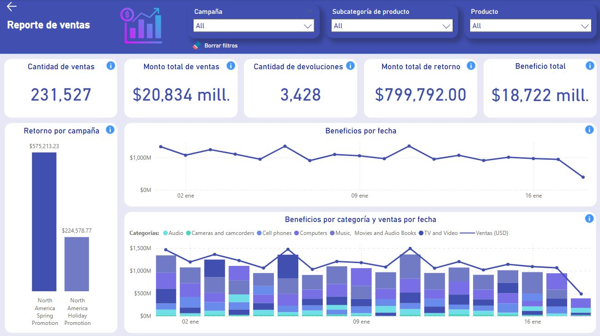

# TechSales Sales Report

📌 Also available in [Spanish](README.es.md) | 📌 Disponible también en [Español](README.es.md)

This dashboard developed in Power BI is designed to analyze TechSales sales and evaluate its financial performance over an 18-day period, especially in North America.

📌 **Note:** All dashboard visualizations are labeled in Spanish, please refer to the table below for English translations.

## Objective:

To understand the company's financial performance by considering the amount of sales and collected profits, how much has been refunded through campaigns, and how much profit has been generated by product category.

### 📌 Dashboard labels – Spanish to English:

| Spanish                   | English                        |
|---------------------------|--------------------------------|
| Reporte de ventas         | Sales Report                   |
| Campaña                   | Campaign                       |
| Subcategoría de producto  | Product Subcategory            |
| Producto                  | Product                        |
| Cantidad de ventas        | Number of Sales                |
| Monto total de ventas     | Total Sales Amount             |
| Cantidad de devoluciones  | Number of Returns              |
| Monto total de retorno    | Total Refund Amount            |
| Beneficio total           | Total Profit                   |
| Retorno por campaña       | Refund by Campaign             |
| Beneficios por fecha      | Profit by Date                 |
| Beneficios por categoría  | Profit by Category             |
| Ventas por fecha          | Sales by Date                  |

## Key indicators:

- **Sales**: number of sales made. 
- **Refund**: amount to be refunded to buyers due to product returns.
- **Returns**: quantity of products returned by customers.
- **Profit**: net profit earned by the company (sales - costs).

## Repository content:

- `ventas_techsales.pbix`: Power BI dashboard file
- `📁data`: folder with CSV files (dataset)

## Technologies and concepts applied:

  - Power BI: ETL
  - DAX
  - Storytelling
  - Data modeling
